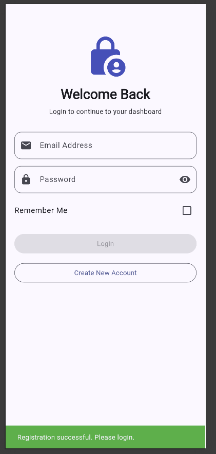
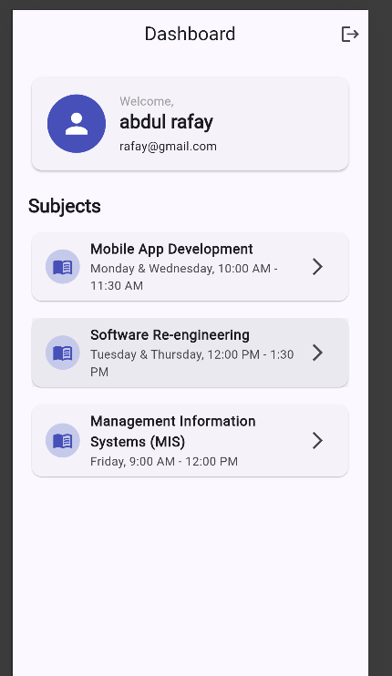
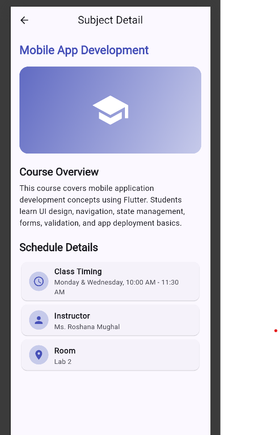
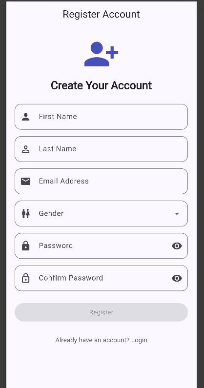
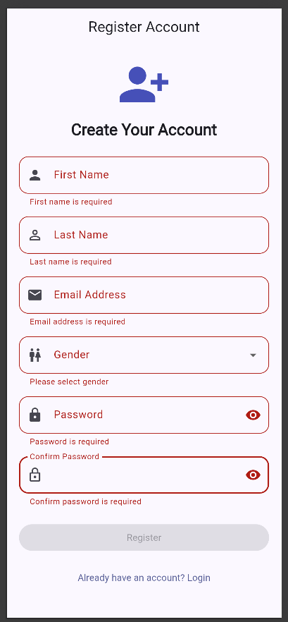

# Flutter Authentication App — CRUD API Extension

A Flutter multi-screen application featuring user authentication and full CRUD integration with the JSONPlaceholder REST API.

---

## Branch

**`feature/course-api-integration`**

---

## API Used

**JSONPlaceholder** — Free fake REST API for testing and prototyping  
🔗 https://jsonplaceholder.typicode.com  
📖 Documentation followed: https://jsonplaceholder.typicode.com/guide

The app uses the `/posts` endpoint as "courses":

| Operation | Method | Endpoint |
|-----------|--------|----------|
| Fetch Courses | GET | `/posts?_limit=10` |
| Add Course | POST | `/posts` |
| Update Course | PUT | `/posts/{id}` |
| Delete Course | DELETE | `/posts/{id}` |

---

## Features

### Existing (Authentication)
- User Registration with validation
- Login with session persistence (SharedPreferences)
- Remember Me functionality
- Multi-screen navigation

### New (CRUD API Integration)
- ✅ **Fetch Courses (GET)** — Load courses from API with loading indicator and error handling
- ✅ **Add Course (POST)** — Create new course, reflected immediately in UI
- ✅ **Edit Course (PUT)** — Pre-filled form, updates reflected in list
- ✅ **Delete Course (DELETE)** — Confirmation dialog, item removed on success
- ✅ **Loading / Success / Error states** — All API operations handle all three states
- ✅ **Pull-to-refresh** — Swipe down to reload the course list

---

## Architecture

```
lib/
├── controllers/
│   ├── auth_controller.dart       # Auth state management
│   └── course_controller.dart     # Course CRUD state management ← NEW
├── models/
│   ├── user_model.dart
│   ├── subject_model.dart
│   └── course_model.dart          # JSONPlaceholder post model ← NEW
├── screens/
│   ├── login_screen.dart
│   ├── registration_screen.dart
│   ├── dashboard_screen.dart      # Updated with bottom nav + Courses tab
│   ├── detail_screen.dart
│   ├── courses_screen.dart        # CRUD list screen ← NEW
│   └── course_form_screen.dart    # Add / Edit form ← NEW
├── services/
│   ├── session_service.dart
│   └── course_api_service.dart    # All API calls (separate service layer) ← NEW
├── enums/
├── validators/
├── widgets/
└── main.dart
```

**Separation of concerns:**
- `CourseApiService` — raw HTTP calls only, no UI knowledge
- `CourseController` — state management, calls service, exposes state to UI
- Screens — read controller state, call controller methods, never touch service directly

---

## Screenshots

| Login | Dashboard | Courses List |
|-------|-----------|--------------|
|  |  |  |

| Add Course | Edit Course | Delete Confirm |
|------------|-------------|----------------|
|  |  |  |

---

## Getting Started

```bash
# Clone and switch to feature branch
git checkout feature/course-api-integration

# Install dependencies
flutter pub get

# Run the app
flutter run
```

**Requirements:** Flutter SDK ≥ 3.11.5, Dart SDK ≥ 3.x
